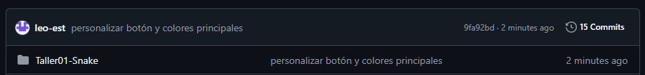
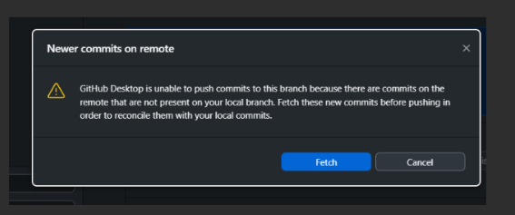
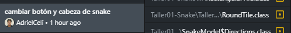
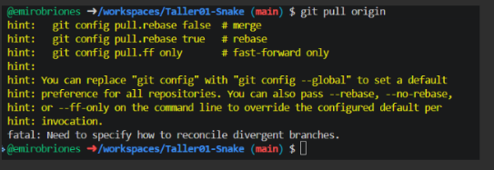
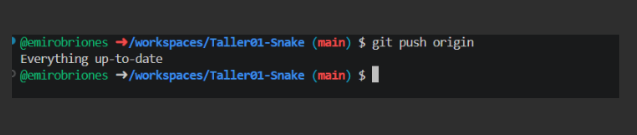
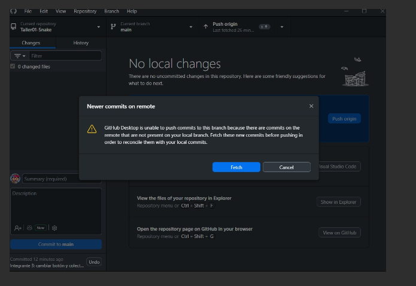
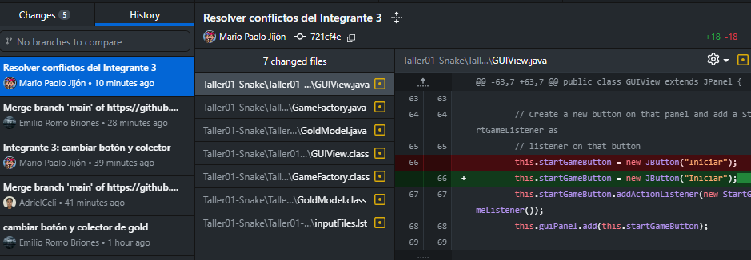

# Taller01-Snake

Trabajo del grupo #2 paralelo 3 

| Rol | Nombre | Usuario de GitHub | Commit principal |
| --- | --- | --- | --- |
| Líder | Leonarrdo Estrada | leo-est  | personalizar botón y colores principales |
| Integrante 1 | Adriel Celi | AdrielCeli | cambiar botón y cabeza de snake |
| Integrante 2 | Emilio Romo  | emirobriones | cambiar botón y colector de gold |
| Integrante 3 | Mario Jijon  | mario-jijon  | cambiar botón y colector |

### Líder

Push exitoso:

### Integrante 1

Error antes de resolver conflicto:

Push exitoso después de resolver conflicto:

### Integrante 2

Error antes de resolver conflicto:

Push exitoso después de resolver conflicto:

### Integrante 3

Error antes de resolver conflicto:

Push exitoso después de resolver conflicto:

